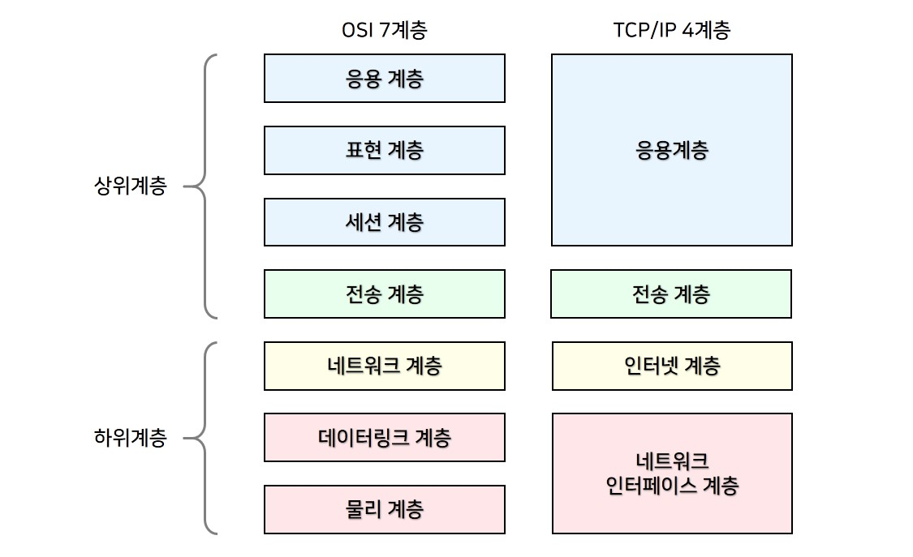

# 1⃣ HTTP의 이해

## HTTP (HyperText Transfer Protocol)

> **HTML과 같은 하이퍼미디어 문서를 전송하기 위한 **<mark style="color:purple;">**애플리케이션 레이어**</mark>**  **<mark style="color:purple;">**프로토콜**</mark>
>
> [https://developer.mozilla.org/ko/docs/Web/HTTP](https://developer.mozilla.org/ko/docs/Web/HTTP)

#### <mark style="color:purple;">프로토콜이란?</mark>

> 규칙의 집합, 규약, 약속

#### <mark style="color:purple;">**애플리케이션 레이어란?**</mark>

> [https://ko.wikipedia.org/wiki/OSI\_%EB%AA%A8%ED%98%95](https://ko.wikipedia.org/wiki/OSI\_%EB%AA%A8%ED%98%95)

<figure><figcaption>
OSI 7 계층
</figcaption></figure>

<figure><figcaption>
WEB은 HTTP부터 그 위를 통틀어서 말한다.
</figcaption></figure>

## HTTP와 HTTPS의 차이(TLS)

HTTP는 웹 표준 프로토

## 클라이언트-서버 모델

## stateless와 stateful

## HTTP Cookie와 HTTP Session

## HTTP 메시지 구조

* HTTP 요청(Request)와 응답(Response)

### HTTP Method (요청)

> [https://developer.mozilla.org/ko/docs/Web/HTTP/Methods](https://developer.mozilla.org/ko/docs/Web/HTTP/Methods)

1. GET → Read
2. HEAD → GET without body
3. POST → Submit (<mark style="color:purple;">**멱등성X**</mark>) ⇒ Collection Pattern에서 Create로 사용
4. PUT → Update (+Create) ⇒ Overwrite!
5. PATCH → Update (partial) (<mark style="color:purple;">**멱등성X**</mark>)
6. DELETE → Delete
7. OPTIONS → 지원 확인

### 멱등성이란?

### HTTP Status Code (응답)

> [https://developer.mozilla.org/ko/docs/Web/HTTP/Status](https://developer.mozilla.org/ko/docs/Web/HTTP/Status)

1. 1xx → 정보 ⇒ 우리가 직접 쓰는 일은 드물다.
2. 2xx → 성공 ⇒ 200 OK, 201 Created, 204 No Content
3. 3xx → <mark style="color:purple;">**리다이렉션**</mark> ⇒ 304 Not Modified가 특수한 형태로 자주 보임.
4. 4xx → 클라이언트 쪽 문제 ⇒ 404 Not Found
5. 5xx → 서버 쪽 문제 ⇒ 500 Internal Server Error

### 리다이렉션이란?

####

